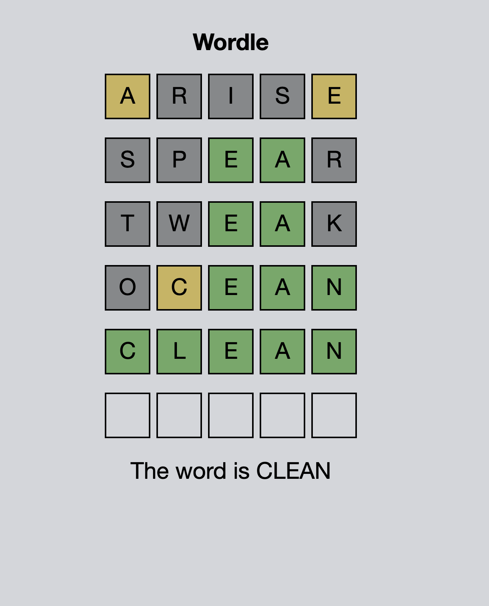

# Wordle Clone
This is a simple [Wordle](https://www.nytimes.com/games/wordle/index.html) clone written in [React](https://reactjs.org/)

## ‍🏃 Running locally

1. Clone the project:
    ```sh
    https://github.com/lara-mpt/wordle-clone.git
    ```
   
2. Start the game:
    ```sh
    npm start
    ```

3. Visit http://localhost:3000 to play the game!

## 📷 Screenshots


